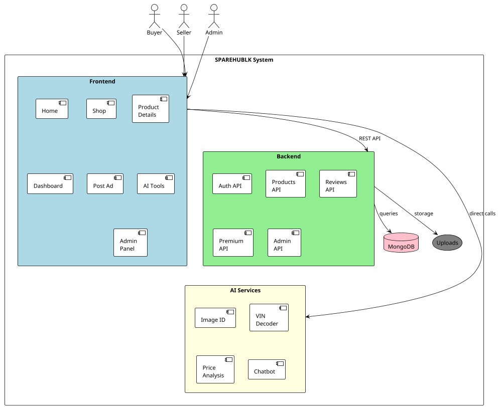

# 1. Introduction

## 1.1 Project Background and Problem Context

The automobile sector in Sri Lanka has grown steadily over the past decade, with a large number of private vehicles being used for daily transportation. As vehicles age, the demand for spare parts increases, particularly for maintenance and repairs. Vehicle owners, mechanics, and small spare parts sellers are continuously involved in buying and selling automobile spare parts. Despite this high demand, the process of finding suitable spare parts remains inefficient and unreliable.

At present, most people rely on social media platforms, messaging groups, or general online marketplaces to search for spare parts. These platforms are not designed specifically for automobile spare parts, which makes the process difficult. Listings often lack proper technical details, images are unclear, and there is no structured way to verify whether a part is compatible with a specific vehicle model. This situation creates confusion and leads to frequent incorrect purchases.

From the seller's perspective, there is also no proper platform dedicated to spare parts trading. Sellers struggle to reach the correct buyers and often do not know how to price their items fairly, especially when dealing with used or rare parts. As a result, the overall spare parts market remains fragmented and inefficient.

With the advancement of artificial intelligence and web technologies, there is an opportunity to improve this situation. Intelligent systems can assist users in identifying parts, matching them with vehicles, and suggesting reasonable prices. A dedicated web-based solution can bring structure, accuracy, and reliability to the automobile spare parts market in Sri Lanka.

## 1.2 Problem Statement

The current methods used for buying and selling automobile spare parts in Sri Lanka are inefficient and unreliable. Buyers face difficulty in identifying correct parts that match their vehicle models, which often results in wasted time and incorrect purchases. Sellers lack a dedicated platform to present detailed information about their spare parts and struggle to determine fair pricing. Existing online platforms do not provide intelligent tools such as part compatibility checking, image-based identification, or price guidance. This project aims to address these problems by developing a dedicated web-based platform that uses artificial intelligence to support accurate and efficient automobile spare parts trading.

The specific problems identified through requirements gathering are summarised in Table 1.

**Table 1: Identified Problems in the Current Spare Parts Market**

| No. | Problem |
|-----|---------|
| 1 | Difficult to identify the correct spare part for a specific vehicle |
| 2 | No image-based intelligent search capability |
| 3 | No automated price guidance for buyers or sellers |
| 4 | Many irrelevant search results on general marketplaces |
| 5 | Lack of proper filtering and compatibility verification |
| 6 | Time-consuming manual searching across multiple platforms |

## 1.3 Specific Project Objectives

### Main Objective
To develop an AI-powered online marketplace for vehicle spare parts in Sri Lanka that improves the efficiency, accuracy, and reliability of spare parts trading.

### Specific Objectives
1. Develop a secure user registration and authentication system with role-based access control (buyer, seller, admin).
2. Allow sellers to create, manage, and publish spare part listings with images, specifications, and vehicle compatibility details.
3. Implement an AI-powered image identification feature that allows users to upload photos of spare parts and receive matching product suggestions.
4. Develop a VIN and chassis number decoder that extracts vehicle details and suggests compatible parts from the inventory.
5. Implement a price analysis module that evaluates listed prices against market conditions and provides guidance to users.
6. Develop a conversational AI chatbot to assist users with spare parts queries and navigation.
7. Create a premium seller tier system with enhanced shop profiles, verification, and priority listing features.
8. Implement a review and rating system for both products and sellers to build trust within the platform.
9. Build an admin dashboard for user management, product moderation, and application processing.
10. Ensure system security, performance, and usability through appropriate design and testing practices.

## 1.4 Project Deliverables and Scope

### 1.4.1 Technical Deliverables
- A fully functional web application with frontend and backend components.
- A RESTful API supporting all core marketplace operations.
- MongoDB database with structured schemas for users, products, reviews, and applications.
- AI integration modules for image recognition, VIN decoding, price analysis, and conversational assistance.
- Admin dashboard with user, product, and application management capabilities.

### 1.4.2 Operational Scope
- User registration, authentication, and profile management.
- Spare part listing creation with images, specifications, and location mapping.
- Product browsing, search, and filtering by category, condition, price, vehicle model, year, and engine type.
- AI-assisted tools for part identification, compatibility checking, and price guidance.
- Seller profile pages with inventory display and review aggregation.
- Premium seller application and verification workflow.
- Review and rating submission for products and sellers.
- Platform feedback collection and admin moderation tools.

### 1.4.3 System Exclusions
The following features are explicitly outside the scope of this project:
- Online payment processing or e-commerce transaction handling.
- Real-time user-to-user messaging (the system provides an AI chatbot instead).
- Commercial deployment or production hosting infrastructure.
- Native mobile applications (the system is web-only).
- Advanced machine learning model training with custom datasets (the system uses pre-trained API-based AI).

## 1.5 Report Structure

The remainder of this report is organised as follows. Chapter 2 presents a review of relevant literature on online marketplaces, AI in e-commerce, image recognition, and price prediction. Chapter 3 describes the methodology, including the development approach, technological choices, and data collection methods. Chapter 4 details the requirements specification. Chapter 5 presents the system architecture and design. Chapter 6 covers the implementation process. Chapter 7 discusses testing and evaluation. Chapter 8 provides the end-project report with objective evaluation. Chapter 9 contains the project post-mortem. Chapter 10 presents the conclusions. References and appendices follow the main body.

---

**Figure 1.1: Conceptual Diagram of SPAREHUBLK System Overview**

