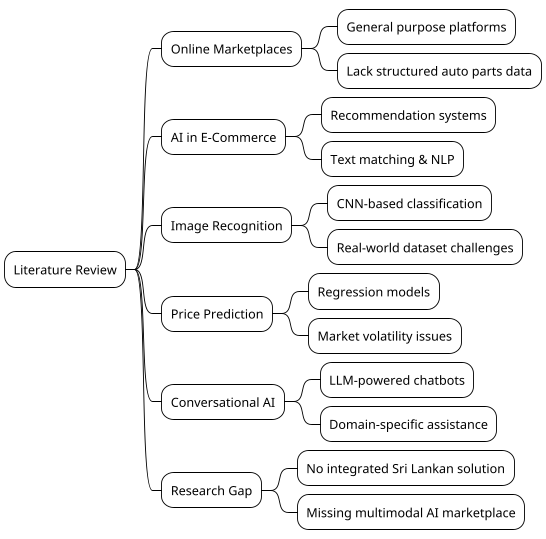

# 2. Literature Review

## 2.1 Online Spare Parts Marketplaces

Online marketplaces have fundamentally transformed how buyers and sellers interact across numerous industries. In the automotive sector, dedicated spare parts platforms improve convenience and accessibility by allowing users to browse extensive catalogues from multiple vendors without geographical constraints. In Sri Lanka, platforms such as Ikman.lk and Riyasewana.lk are commonly used to trade vehicle spare parts. These platforms allow users to list and browse items but often lack structured information about part compatibility or accurate descriptions. Listings are frequently created with minimal technical detail, and buyers must rely on direct communication with sellers to verify compatibility. This can result in mismatched purchases and longer search times for buyers (Ikman.lk, 2025; Riyasewana.lk, 2025).

Research by Kapruka Blog (2025) on online selling in Sri Lanka highlights that general marketplaces are not optimised for specialised product categories. Users encounter challenges with search relevance, filtering capabilities, and the absence of technical specifications. This gap in the market underscores the need for a platform specifically architected for automotive components.

## 2.2 Artificial Intelligence in Recommendation and Matching Systems

Artificial intelligence techniques, including machine learning and natural language processing, are widely used in e-commerce to improve product recommendations and matching. Text-based matching can increase search relevance by analysing user queries and product descriptions to identify semantic relationships beyond simple keyword overlap. However, its effectiveness depends on the quality and consistency of listings. In Sri Lanka, many sellers provide descriptions in mixed languages or with incomplete details, making accurate matching difficult (Python Sri Lanka, 2025).

AI-powered recommendation engines in platforms such as Amazon and eBay analyse user behaviour, purchase history, and browsing patterns to suggest relevant products. These systems rely on large datasets and continuous model refinement. For a specialised marketplace like SPAREHUBLK, the challenge lies in adapting general recommendation principles to a domain where technical accuracy is critical and training data may be limited.

## 2.3 Image Recognition for Object Identification

Convolutional Neural Networks (CNNs) have become the dominant approach for image recognition tasks across various domains. In spare parts trading, image-based identification can help users who lack technical knowledge or part numbers. This is particularly relevant in Sri Lanka, where buyers often rely on visual inspection rather than precise part numbers when searching for components (TensorFlow Blog, 2025).

Studies have demonstrated that deep learning models can achieve high accuracy in classifying mechanical components when trained on comprehensive datasets. However, most published research is based on controlled datasets with uniform lighting, angles, and backgrounds. Few studies examine performance in informal or second-hand market environments where images are captured with mobile phones under variable conditions. This represents a significant research gap that SPAREHUBLK addresses by using modern generative AI models capable of understanding diverse visual inputs.

## 2.4 Price Prediction Models

Regression-based machine learning models are commonly used to predict prices from historical data and item attributes. Linear regression, decision trees, and ensemble methods such as Random Forest and Gradient Boosting have been applied to pricing problems in e-commerce. Their accuracy is influenced by data quality, market stability, and the richness of feature sets.

In the Sri Lankan context, spare part prices vary depending on condition, availability, import status, and seller location. Few academic studies focus specifically on price guidance for used automotive parts in developing markets. Most existing price prediction research concentrates on new parts in structured supply chains or on general second-hand goods. The volatility of the used parts market, combined with limited historical transaction data, makes this a challenging domain for traditional regression approaches.

## 2.5 Conversational AI in E-Commerce

Conversational AI, powered by Large Language Models (LLMs), has emerged as a significant tool for customer service and product discovery in e-commerce. Chatbots can handle natural language queries, provide product recommendations, and guide users through complex catalogues. The integration of LLMs allows for more nuanced understanding of user intent compared to rule-based or retrieval-based chatbot systems.

In the automotive domain, conversational AI can assist users who are unsure about technical terminology or part compatibility. By asking clarifying questions and interpreting informal descriptions, an AI assistant can bridge the knowledge gap between expert mechanics and everyday vehicle owners.

## 2.6 Identified Research Gap

Current literature and platforms reveal a lack of localised, intelligent systems for automobile spare parts trading in Sri Lanka. Existing solutions rarely combine text matching, image recognition, price suggestion, and conversational assistance in a single platform. General marketplaces lack the domain-specific structure necessary for accurate part compatibility verification. AI research in component identification focuses primarily on controlled environments rather than real-world market conditions.

SPAREHUBLK aims to address this gap by integrating multiple AI-assisted features into a web-based system designed specifically for the Sri Lankan automotive spare parts market. The platform combines structured data entry with intelligent search, visual identification, price guidance, and conversational support to create a comprehensive solution that is not currently available in the local market.

---

**[Placeholder for Table 2.1: Comparison of Existing Platforms and SPAREHUBLK]**

| Feature | General Marketplaces | SPAREHUBLK |
|---------|---------------------|------------|
| Spare part listing | Yes | Yes |
| Basic keyword search | Yes | Yes |
| Chassis number decoding | No | Yes |
| AI image recognition | No | Yes |
| Price guidance | No | Yes |
| Smart filtering | Limited | Advanced |
| Seller verification / Premium tiers | Limited | Yes |
| Product and seller reviews | Limited | Yes |

---

**Figure 2.1: Summary of Literature Review Themes**

