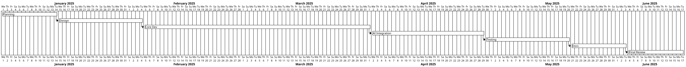
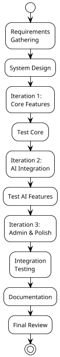

# 3. Methodology

## 3.1 Development Methodology

The development of SPAREHUBLK follows the Agile methodology. Agile was selected because it allows the project to be developed incrementally rather than building all components simultaneously. The system was divided into smaller, manageable parts, with each part being developed, tested, and refined before moving to the next. This approach makes it easier to identify mistakes early and correct them without affecting the entire system.

The main reasons for choosing Agile are:
- It supports gradual improvement and iterative enhancement.
- It allows feedback to be incorporated during development.
- It reduces risk by delivering working software in short cycles.
- It helps manage time effectively through prioritisation and sprint planning.

During development, features such as user authentication, spare part listing, and basic search were completed first. Advanced features such as AI-powered image recognition, VIN decoding, and price analysis were integrated gradually in subsequent iterations. This method ensured that the system remained stable while new functions were added.

The project was planned to be completed over approximately seven months, divided into the following phases:

**Table 3.1: Project Phases and Timeline**

| Phase | Duration | Key Activities |
|-------|----------|---------------|
| Planning and Research | 2 weeks | Identify problem, gather requirements, review existing systems |
| System Design | 3 weeks | Create design documents, wireframes, database schema |
| Development (Core) | 8 weeks | Build frontend, backend, database; implement basic functionality |
| AI Feature Integration | 4 weeks | Develop and integrate AI modules for part matching, image recognition, and price suggestion |
| Testing | 3 weeks | Test system functionality, AI accuracy, and user interface usability |
| Documentation | 2 weeks | Prepare reports, diagrams, and project documentation |
| Final Review | 2 weeks | Make final adjustments and submit the project |

**Figure 3.1: Gantt Chart of Project Timeline**

## 3.2 Research Design and Data Collection

This project follows a prototype-based applied research approach. The main focus is on designing, building, and testing a working system rather than only creating theoretical models. Each feature was developed and improved step by step based on testing results and feedback.

### 3.2.1 Facts Gathering Techniques
Information was collected using multiple techniques:
- **Interviews:** Conversations with mechanics and vehicle owners to understand their pain points when searching for spare parts.
- **Online Research:** Analysis of existing local and international platforms to identify feature gaps and best practices.
- **User Behaviour Observation:** Examination of how users currently search for parts on general marketplaces, noting the prevalence of keyword-only searching and the absence of structured filters.
- **Feedback Collection:** Input from potential users helped identify key system requirements and prioritise features.

### 3.2.2 Data Sources
The system uses data such as spare part descriptions, images of parts, and basic vehicle information. Sample data was collected from publicly available websites and voluntary contributions. No personal or sensitive data was stored improperly. Images were managed securely during testing to ensure data safety.

## 3.3 Technological Stack Justification

The system was developed as a web-based platform using modern, open-source technologies. The choice of each technology was guided by factors including community support, learning curve, performance characteristics, and suitability for the project's requirements.

**Table 3.2: Technologies Used in the System**

| Component | Technology Used | Purpose |
|-----------|-----------------|---------|
| Frontend | React 19 with Vite | To create an interactive, modern user interface |
| Styling | Tailwind CSS 4 | Utility-first CSS framework for rapid UI development |
| Animation | Framer Motion | Smooth UI transitions and component animations |
| Icons | Lucide React | Consistent iconography across the application |
| Routing | React Router DOM 7 | Client-side navigation and deep linking |
| Backend Runtime | Node.js | Server-side JavaScript execution |
| Backend Framework | Express.js 5 | RESTful API route management and middleware |
| Database | MongoDB with Mongoose 9 | Document-oriented data storage and schema modelling |
| Authentication | JSON Web Tokens (JWT) | Stateless session management with bcrypt password hashing |
| File Uploads | Multer | Disk storage for product images, memory storage for profile pictures |
| AI / LLM | Google Generative AI SDK | Image identification, VIN decoding, price analysis, conversational chatbot |
| Maps | Leaflet (CDN) | Location picker for listings and seller map display |
| Version Control | Git | Project change tracking and collaboration |
| Development Tool | Visual Studio Code | Code editing and project management |

### 3.3.1 Frontend Framework Justification
React was chosen for the frontend because of its component-based architecture, which promotes reusability and maintainability. Vite was selected as the build tool over Create React App due to its significantly faster development server startup and hot module replacement. Tailwind CSS was adopted to enable rapid styling without the overhead of writing custom CSS files, while maintaining design consistency through its utility-first approach.

### 3.3.2 Backend and Database Justification
Node.js with Express.js provides a lightweight, high-performance backend that uses the same language (JavaScript) as the frontend, reducing context switching during development. MongoDB was chosen because its document-oriented model aligns well with the flexible, hierarchical nature of product listings, user profiles, and review data. Mongoose provides schema validation and query building that improves code reliability.

### 3.3.3 AI Technology Pivot
The original project plan proposed custom TensorFlow/Keras models for image classification and regression-based price prediction. During development, it became apparent that training accurate custom models would require datasets far larger than what could be reasonably collected for an academic project. Furthermore, the computational resources and training time for CNNs and regression models would have significantly extended the development timeline.

After evaluating alternatives, the project pivoted to using the Google Gemini API for AI capabilities. This decision was based on several factors:
- **Data Availability:** Gemini models are pre-trained on billions of images and text samples, eliminating the need for extensive custom dataset collection.
- **Accuracy:** State-of-the-art generative AI models achieve high performance on visual understanding and natural language reasoning tasks without domain-specific fine-tuning.
- **Development Velocity:** API integration allowed AI features to be implemented in days rather than weeks of model training and hyperparameter tuning.
- **Maintainability:** Using a managed API reduces the infrastructure burden of hosting and updating custom models.
- **Multimodality:** A single Gemini model handles image identification, text generation, VIN decoding, and price analysis, simplifying the architecture.

While this pivot means the project relies on external AI services rather than internally trained models, it represents a pragmatic engineering decision that allowed the project to deliver functional, accurate AI features within academic constraints.

## 3.4 Algorithms and AI Integration Approach

### 3.4.1 Text-Based Search and Matching
The platform implements full-text search across product titles, descriptions, and specifications. MongoDB's text indexing capabilities support keyword and phrase matching. Advanced filtering by category, vehicle model, year, engine type, condition, and price range is applied at the database query level to ensure efficient retrieval.

### 3.4.2 Image-Based Part Identification
When a user uploads an image of a spare part, the frontend sends the image to the Google Gemini API with a structured prompt requesting identification. The model returns a description and suggested part category, which is then used to trigger a search against the product inventory. This bridges the gap between visual inspection and structured catalogue searching.

### 3.4.3 VIN and Chassis Number Decoding
The VIN decoder accepts a vehicle identification number or local chassis code (e.g., KSP130, NZE121) and queries the Gemini API with a prompt designed to extract vehicle make, model, year, engine type, and compatible part categories. The decoded information is then matched against listing specifications to suggest compatible parts.

### 3.4.4 Price Analysis and Market Intelligence
The price analysis feature evaluates a listed price by providing the product title, condition, and price to the Gemini API with a prompt requesting market context analysis. The model returns an assessment (fair, underpriced, or overpriced) relative to the Sri Lankan market, along with explanatory reasoning. This provides advisory guidance rather than definitive valuation.

### 3.4.5 Conversational AI Chatbot
The chatbot maintains a message history and sends user queries to the Gemini API with a system prompt that establishes the assistant's domain expertise in Sri Lankan automotive spare parts. The chatbot can answer general questions, help navigate the platform, and provide advice on part compatibility and maintenance.

## 3.5 Evaluation Metrics and Validation

The system was evaluated on functionality, ease of use, and the performance of AI features. Metrics included:
- **Functional Coverage:** Verification that all specified requirements were implemented and operational.
- **Response Time:** Measurement of API and page load times under typical usage conditions.
- **AI Accuracy:** Manual verification of AI feature outputs (image identification, VIN decoding, price analysis) against known correct answers.
- **Usability Assessment:** Evaluation of interface clarity, navigation efficiency, and task completion flows.
- **Security Verification:** Confirmation that authentication, authorisation, and data protection mechanisms functioned correctly.

---

**Figure 3.2: High-Level Development Process Flow**

