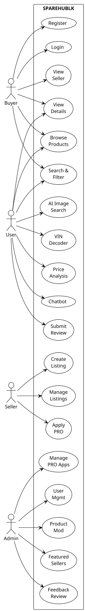

# 4. Requirements Specification

## 4.1 Functional Requirements

The functional requirements describe what the system must do. These were derived from stakeholder interviews, analysis of existing platforms, and the project objectives defined in the initiation document.

**Table 4.1: Key Functional Modules**

| Module | Description |
|--------|-------------|
| User Management | Registration, login, profile management, avatar upload, role-based access (user, seller, admin) |
| Listing Management | Create, edit, delete spare part listings with images, specifications, vehicle compatibility, and location |
| Search Module | Text-based keyword search, advanced filtering by category, model, year, engine, condition, price, and seller |
| AI Tools Suite | Image-based part identification, VIN/chassis decoder, price market intelligence, conversational chatbot |
| Review System | Product reviews with ratings and comments; seller reviews with reputation aggregation |
| Premium Seller System | Application workflow for PRO status, enhanced shop profiles, verification badges, featured seller slots |
| Admin Panel | User management, product moderation, premium application processing, featured seller curation, platform feedback review |
| Map Integration | Location picker for listings using Leaflet map; display seller locations on product pages |

### 4.1.1 Authentication and Authorisation
- The system shall allow users to register with name, phone number, email, and password.
- The system shall allow login using email or username.
- The system shall maintain user sessions using JSON Web Tokens with a 7-day expiration.
- The system shall support three roles: user (buyer), seller, and admin.
- The system shall enforce role-based access control on protected routes.
- The system shall allow users to update profile information and upload profile pictures.

### 4.1.2 Product Listings
- Sellers shall be able to create listings with title, price, condition (new/used), category, sub-category, vehicle model, year, chassis number, location, and specifications.
- Sellers shall be able to upload up to 5 product images per listing.
- The system shall support a live preview during listing creation.
- Listings shall include geolocation coordinates for map display.
- The system shall increment a view counter when product details are accessed.

### 4.1.3 Search and Discovery
- Users shall be able to search by keyword across titles and descriptions.
- Users shall be able to filter by category, vehicle model, year, engine type, condition, price range, and seller.
- Search parameters shall be reflected in the URL for shareability and back-button support.
- Results shall be paginated for performance.

### 4.1.4 AI-Powered Features
- **Image Identification:** Users shall be able to upload a part image; the system shall identify the part and search the inventory for matches.
- **VIN Decoder:** Users shall be able to enter a VIN or chassis code; the system shall decode vehicle details and suggest compatible parts.
- **Price Analysis:** During listing creation or browsing, the system shall analyse price fairness relative to the Sri Lankan market.
- **Chatbot:** Users shall be able to ask natural language questions about spare parts and receive relevant responses.

### 4.1.5 Review and Rating
- Authenticated users shall be able to submit product reviews with a 1-5 star rating and text comment.
- Authenticated users shall be able to submit seller reviews with a 1-5 star rating and text comment.
- The system shall prevent duplicate reviews and self-reviews.
- The system shall recalculate and display average ratings upon review submission or deletion.

### 4.1.6 Premium Seller Workflow
- Users shall be able to apply for PRO seller status by submitting business details, NIC information, and business address.
- Admins shall be able to review applications, approve or reject them, and add approved sellers to a featured list.
- PRO sellers shall receive enhanced shop profiles with customisable themes, banner images, and unlimited listings.

## 4.2 Non-Functional Requirements

### 4.2.1 Performance and Scalability
- The system shall provide page load times under 3 seconds for typical browsing operations.
- API responses shall complete within 2 seconds for database-backed operations.
- AI feature responses may take up to 5 seconds depending on external API latency.
- The database schema shall support indexing on frequently queried fields (title, category, seller, status).

### 4.2.2 Security Standards
- Passwords shall be hashed using bcrypt with a salt round of 10 before storage.
- JWT tokens shall be signed with a secret key and verified on every protected request.
- The system shall verify token validity against the database on each request to prevent stale token usage.
- File uploads shall be validated for type and size; product images are stored on disk while profile images use base64 in the database.
- CORS shall be configured to restrict access to whitelisted origins.

### 4.2.3 Usability
- The interface shall be designed for desktop browsers. Mobile compatibility is not within the current scope.
- Navigation shall be intuitive with consistent layout patterns across pages.
- Form validation shall provide clear, immediate feedback to users.
- Error messages shall be user-friendly and guide corrective action.

### 4.2.4 Reliability
- The system shall handle invalid inputs gracefully without crashing.
- Database connections shall be managed with proper error handling and reconnection logic.
- AI feature failures shall not block core marketplace functionality.

## 4.3 Hardware and Software Requirements

### 4.3.1 Development Environment

**Table 4.2: Development Environment Specifications**

| Component | Requirement |
|-----------|-------------|
| Processor | Intel i5 or above (or equivalent) |
| RAM | Minimum 8GB |
| Storage | SSD with at least 50GB free space |
| Operating System | Windows 10/11, macOS, or Linux |
| Backend Runtime | Node.js 18+ |
| Frontend Build Tool | Vite 7+ |
| Database | MongoDB 6+ (local or Atlas) |
| Browser | Modern Chromium-based, Firefox, or Safari |

### 4.3.2 Production / Deployment Environment
- Backend server with Node.js runtime and public IP or domain.
- MongoDB instance with secure authentication and restricted remote access.
- HTTPS enabled for secure communication.
- Sufficient disk space for product image storage.
- Firewall configuration to restrict non-essential ports.

### 4.3.3 Client-Side Requirements
- Modern web browser with JavaScript enabled.
- Stable internet connection (minimum broadband).
- Camera access for image upload features (optional).
- Location services enabled for map features (optional).

## 4.4 Networking Requirements

The SPAREHUBLK platform follows a client-server architecture. Users access the system through a web browser. The frontend communicates with the backend server through REST API requests. The backend connects to the MongoDB database to store and retrieve data.

### 4.4.1 Communication Protocol
- The system uses HTTP and HTTPS protocols.
- HTTPS is recommended for production deployments.
- Data between frontend and backend is transferred in JSON format.
- Authentication is handled using JWT Bearer tokens.

### 4.4.2 API Communication
- Frontend sends REST API requests to backend endpoints prefixed with `/api/`.
- Backend processes requests, applies business logic, and returns JSON responses.
- Protected endpoints require a valid Authorization header.

### 4.4.3 Database Connection
- Backend connects securely to MongoDB using a connection string.
- Remote database access is restricted to authorised hosts.
- Database credentials are stored in environment variables.

---

**Figure 4.1: Use Case Diagram**

