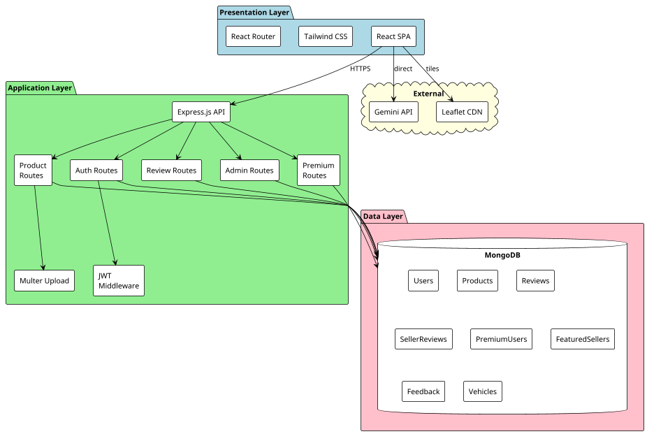
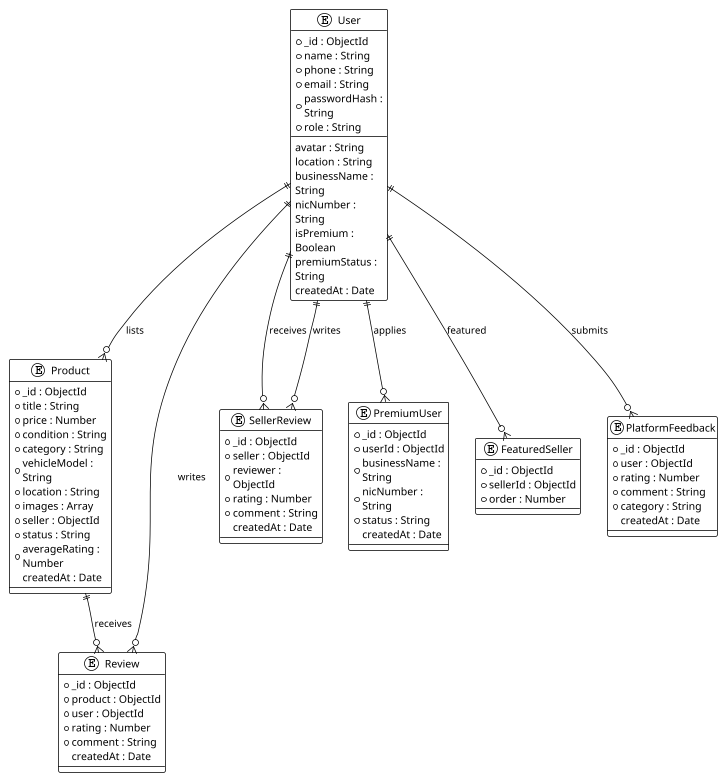
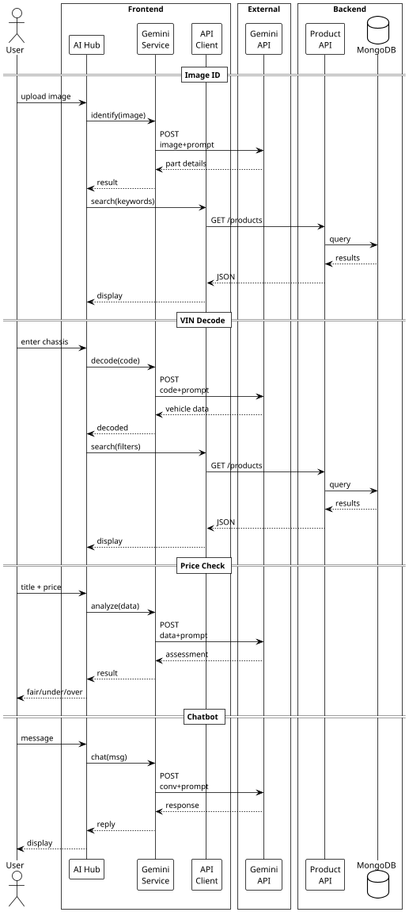
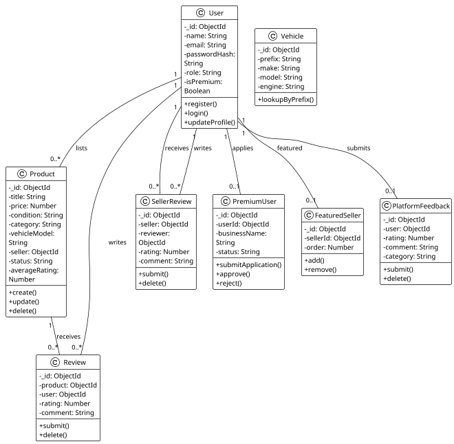
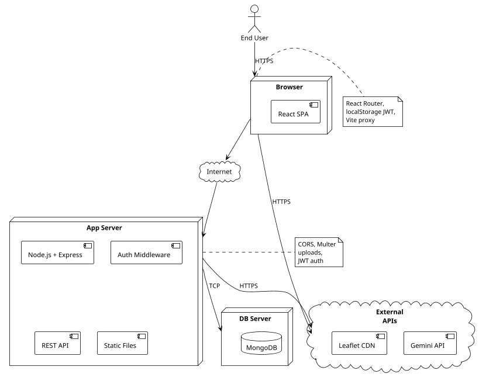

# 5. System Architecture and Design

## 5.1 High-Level System Architecture

SPAREHUBLK follows a three-tier architecture consisting of a presentation layer (frontend), an application layer (backend API), and a data layer (MongoDB database). This separation of concerns allows each tier to be developed, tested, and maintained independently.

**Table 5.1: System Architecture Layers**

| Layer | Technology | Responsibility |
|-------|-----------|--------------|
| Presentation Layer | React 19, Vite, Tailwind CSS | User interface rendering, client-side routing, state management, AI service integration |
| Application Layer | Node.js, Express.js | REST API endpoints, business logic, authentication, file handling, external API communication |
| Data Layer | MongoDB, Mongoose | Data persistence, schema validation, indexing, aggregation queries |

The frontend communicates with the backend via RESTful HTTP requests. During development, Vite's proxy configuration forwards `/api/*` requests to the backend server running on port 5000. The backend processes requests, performs database operations through Mongoose, and returns JSON responses. For AI features, the backend or frontend may communicate directly with the Google Gemini API depending on the specific implementation.

**Figure 5.1: High-Level Architectural Diagram**

## 5.2 Database Schema Design

MongoDB was chosen for its flexibility in handling heterogeneous document structures. The database contains the following primary collections, each represented by a Mongoose schema.

### 5.2.1 User Collection
The User collection stores account information, profile details, and premium status.
- Fields: name, phone, email (unique), passwordHash, role (user/seller/admin), avatar, location, businessName, nicNumber, nicFront, nicBack, businessAddress, city, businessType, isPremium, premiumStatus, bannerImage, shopAvatar.
- Timestamps are enabled for audit purposes.

### 5.2.2 Product Collection
The Product collection stores spare part listings with full specifications and metadata.
- Fields: title, price, condition (New/Used), category, subCategory, vehicleModel, vehicleYear, chassisNumber, location, locationCoords (lat/lng array), specs (key-value pairs), images (URL array), seller (User reference), sellerUsername, sellerPhone, views, status (active/review/sold), averageRating, reviewCount.

### 5.2.3 Review Collections
Two separate collections handle reviews:
- **Review:** Product-level reviews with product reference, user reference, userName, rating (1-5), and comment (max 500 chars). A unique compound index on {product, user} prevents duplicates.
- **SellerReview:** Seller-level reviews with seller reference, reviewer reference, reviewerName, reviewerAvatar, rating, and comment. A unique compound index on {seller, reviewer} prevents duplicates.

### 5.2.4 PremiumUser Collection
Stores formal PRO seller applications for admin workflow.
- Fields: userId (User reference), businessName, fullName, nicNumber, nicFront, nicBack, mobileNumber, email, businessAddress, city, businessType, status (pending/approved/rejected).

### 5.2.5 FeaturedSeller Collection
Admin-curated showcase list.
- Fields: sellerId (User reference), order. Unique index on sellerId.

### 5.2.6 PlatformFeedback Collection
User feedback about the platform.
- Fields: user (User reference), userName, userAvatar, rating, comment, category (platform/selling/buying/support). Unique index on user.

### 5.2.7 Vehicle Collection
A lightweight lookup table for Sri Lankan vehicle data by license plate prefix.
- Fields: prefix, make, model, engine, parts (array).

**Figure 5.2: Entity Relationship (ER) Diagram**

## 5.3 API Design

The backend exposes a RESTful API organised by resource. All endpoints are prefixed with `/api/`.

### 5.3.1 Authentication Endpoints (`/api/auth`)
- `POST /register` - Create new user account
- `POST /login` - Authenticate user (email or username)
- `GET /me` - Retrieve current user profile
- `PUT /profile` - Update profile fields
- `POST /avatar` - Upload profile picture (base64 storage)
- `POST /shop-banner` - Upload shop banner (base64 storage)
- `POST /shop-avatar` - Upload shop avatar (base64 storage)
- `GET /users` - Admin: list all users
- `DELETE /users/:id` - Admin: delete user and cascade related data

### 5.3.2 Product Endpoints (`/api/products`)
- `POST /upload` - Upload up to 5 product images
- `POST /` - Create new listing
- `GET /` - Search/filter products (search, category, seller, model, year, engine)
- `GET /seller/:userId` - Get active products by seller
- `GET /mine` - Get current user's listings
- `GET /:id` - Get single product (increments views)
- `DELETE /:id` - Admin: delete product

### 5.3.3 Premium Endpoints (`/api/premium`)
- `POST /apply` - Submit PRO application
- `GET /my-application` - Get user's application status
- `GET /all` - Admin: view all applications
- `PUT /:id/status` - Admin: approve/reject application
- `GET /search` - Public search for approved PRO sellers
- `DELETE /:id` - Admin: delete application
- `GET /seller/:userId` - Public PRO seller profile

### 5.3.4 Review Endpoints (`/api/reviews` and `/api/seller-reviews`)
- `GET /:productId` - Get product reviews
- `POST /:productId` - Add product review (prevents self-review and duplicates)
- `DELETE /:reviewId` - Delete review (owner or admin)
- `GET /:sellerId/stats` - Get seller rating statistics

### 5.3.5 Featured Sellers (`/api/featured-sellers`)
- `GET /` - Get all featured sellers
- `POST /` - Admin: add featured seller
- `DELETE /:id` - Admin: remove featured seller

### 5.3.6 Platform Feedback (`/api/feedback`)
- `GET /` - Get latest feedback entries
- `GET /stats` - Get aggregate feedback statistics
- `POST /` - Submit feedback (one per user)
- `DELETE /:id` - Delete feedback

### 5.3.7 Vehicle Lookup (`/api/vehicle/:prefix`)
- `GET /:prefix` - Lookup vehicle by Sri Lankan license plate prefix

## 5.4 AI Pipeline Design

The AI features are implemented as client-side services that communicate directly with the Google Gemini API. This design decision simplifies the backend architecture by avoiding the need to proxy AI requests through the server.

### 5.4.1 Image Identification Pipeline
1. User uploads an image through the AI Tools interface.
2. The frontend converts the image to a format suitable for the Gemini API.
3. A structured prompt requests identification of the automotive part, including category and likely vehicle compatibility.
4. Gemini returns a text description.
5. The frontend parses the response and triggers a product search using the identified keywords.

### 5.4.2 VIN Decoding Pipeline
1. User enters a VIN or local chassis code.
2. The frontend sends the code to Gemini with a prompt requesting vehicle make, model, year, engine, and compatible part categories.
3. The response is parsed into structured data.
4. The frontend navigates to the shop page with filters pre-populated from the decoded information.

### 5.4.3 Price Analysis Pipeline
1. During listing creation or when viewing a product, the system sends the title, condition, and price to Gemini.
2. The prompt requests an assessment of whether the price is fair, underpriced, or overpriced for the Sri Lankan market.
3. The model returns an assessment with explanatory reasoning.
4. The result is displayed to the user as advisory information.

### 5.4.4 Conversational Chatbot Pipeline
1. User sends a message through the chat interface.
2. The message is appended to a conversation history array.
3. The history is sent to Gemini with a system prompt establishing domain expertise in Sri Lankan automotive spare parts.
4. The model's response is displayed in the chat interface and added to the history.

**Figure 5.3: AI Pipeline Flow Diagram**

## 5.5 Class Diagram

The system's object model is organised around the major domain entities. Each entity corresponds to a Mongoose model on the backend and is represented as data objects in the frontend.

**Figure 5.4: Class Diagram of the Proposed System**

## 5.6 Networking and Deployment Design

The system follows a standard client-server networking model.

### 5.6.1 Development Configuration
- Frontend runs on `localhost:5173` (Vite dev server).
- Backend runs on `localhost:5000` (Node.js/Express).
- Vite proxy forwards `/api/*` and `/uploads` to the backend.
- MongoDB runs locally on `localhost:27017`.
- CORS is configured to allow the frontend origin.

### 5.6.2 Production Considerations
- Frontend static files are served by a web server (e.g., Nginx) or CDN.
- Backend runs as a persistent service with a process manager (e.g., PM2).
- MongoDB is hosted on a managed service (e.g., MongoDB Atlas) or dedicated server.
- HTTPS is enforced for all communications.
- Environment variables are used for secrets (JWT_SECRET, Mongo URI, API keys).

**Figure 5.5: Networking Diagram**

## 5.7 Security Design

### 5.7.1 Authentication Flow
1. User submits credentials to `/api/auth/login`.
2. Backend verifies password using bcrypt comparison.
3. Upon success, a JWT is signed with user ID, name, and role, valid for 7 days.
4. Frontend stores token in localStorage and sends it in the Authorization header for subsequent requests.
5. The `verifyToken` middleware decodes the JWT and re-fetches the user from the database to ensure validity.

### 5.7.2 Authorisation
- Role checks are performed inline in route handlers.
- Admin endpoints return 403 for non-admin users.
- Ownership checks compare `req.user.id` against document owner fields.
- Product image URLs are publicly accessible, but listing creation and modification require authentication.

### 5.7.3 Data Protection
- Passwords are never stored in plain text.
- Profile images (avatar, banner, shop avatar) are stored as base64 in the database, keeping user data self-contained.
- Product images are stored on disk with generated filenames to prevent path traversal.
- MongoDB connection strings and JWT secrets are stored in environment variables.

---

**Table 5.2: API Endpoint Summary by Module**

*Full endpoint descriptions are provided in Section 5.3. The tables below present a concise reference grouped by module.*

**Auth Module (`/api/auth`)**

| Method | Endpoint | Auth | Description |
|--------|----------|------|-------------|
| POST | `/register` | No | Register new user account |
| POST | `/login` | No | Authenticate user |
| GET | `/me` | Yes | Get current user profile |
| PUT | `/profile` | Yes | Update profile fields |
| POST | `/avatar` | Yes | Upload profile picture |
| POST | `/shop-banner` | Yes | Upload shop banner |
| POST | `/shop-avatar` | Yes | Upload shop avatar |
| GET | `/users` | Admin | List all users |
| DELETE | `/users/:id` | Admin | Delete user and cascade data |

**Products Module (`/api/products`)**

| Method | Endpoint | Auth | Description |
|--------|----------|------|-------------|
| POST | `/upload` | Yes | Upload up to 5 product images |
| POST | `/` | Yes | Create new listing |
| GET | `/` | No | Search and filter products |
| GET | `/seller/:userId` | No | Get active products by seller |
| GET | `/mine` | Yes | Get current user's listings |
| GET | `/:id` | No | Get single product details |
| DELETE | `/:id` | Admin | Delete product |

**Premium Module (`/api/premium`)**

| Method | Endpoint | Auth | Description |
|--------|----------|------|-------------|
| POST | `/apply` | Yes | Submit PRO application |
| GET | `/my-application` | Yes | Get user's application status |
| GET | `/all` | Admin | View all applications |
| PUT | `/:id/status` | Admin | Approve or reject application |
| GET | `/search` | No | Search approved PRO sellers |
| DELETE | `/:id` | Admin | Delete application |
| GET | `/seller/:userId` | No | Get PRO seller profile |

**Reviews Module (`/api/reviews`)**

| Method | Endpoint | Auth | Description |
|--------|----------|------|-------------|
| GET | `/:productId` | No | Get all product reviews |
| POST | `/:productId` | Yes | Add a product review |
| DELETE | `/:reviewId` | Yes / Admin | Delete a review |

**Seller Reviews Module (`/api/seller-reviews`)**

| Method | Endpoint | Auth | Description |
|--------|----------|------|-------------|
| GET | `/:sellerId` | No | Get all seller reviews |
| GET | `/:sellerId/stats` | No | Get seller rating statistics |
| POST | `/:sellerId` | Yes | Add a seller review |
| DELETE | `/:reviewId` | Yes / Admin | Delete a seller review |

**Featured Sellers Module (`/api/featured-sellers`)**

| Method | Endpoint | Auth | Description |
|--------|----------|------|-------------|
| GET | `/` | No | Get all featured sellers |
| POST | `/` | Admin | Add a seller to featured list |
| DELETE | `/:id` | Admin | Remove from featured list |

**Platform Feedback Module (`/api/feedback`)**

| Method | Endpoint | Auth | Description |
|--------|----------|------|-------------|
| GET | `/` | No | Get latest feedback entries |
| GET | `/stats` | No | Get aggregate feedback statistics |
| POST | `/` | Yes | Submit platform feedback |
| DELETE | `/:id` | Yes / Admin | Delete feedback entry |

**Vehicle Lookup Module (`/api/vehicle`)**

| Method | Endpoint | Auth | Description |
|--------|----------|------|-------------|
| GET | `/:prefix` | No | Lookup vehicle by license plate prefix |
