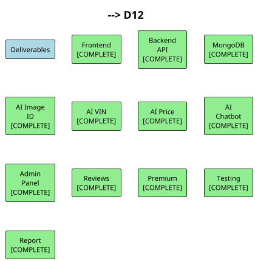

# 8. End-Project Report

## 8.1 Project Summary

SPAREHUBLK is an AI-powered web-based marketplace for automobile spare parts trading in Sri Lanka. The project was conceived to address the inefficiencies and uncertainties faced by vehicle owners, mechanics, and sellers when using general-purpose online platforms for spare parts transactions. The system provides structured listings, intelligent search and filtering, AI-assisted part identification, VIN decoding, price analysis, and a conversational chatbot, all within a modern web application built for desktop browsers on the MERN stack.

The development was completed over approximately seven months using an Agile incremental approach. Core marketplace functionality was implemented first, followed by the integration of AI features, and finally testing and refinement. The resulting prototype demonstrates a viable solution to the problems identified in the initial problem statement.

## 8.2 Objectives Evaluation

The following table critically evaluates each project objective against what was achieved.

**Table 8.1: Objectives Evaluation**

| Objective | Target | Achieved | Evaluation |
|-----------|--------|----------|------------|
| Develop secure user registration and authentication | Secure registration, login, JWT sessions, role-based access | Fully implemented with bcrypt hashing, JWT verification, and database-backed token validation | Met |
| Allow sellers to create listings with images | Multi-step wizard with up to 5 images, specifications, and location | Fully implemented with live preview and structured data entry | Met |
| Implement AI image classification | TensorFlow/Keras custom model | Pivot to Google Gemini API for image identification; functional and accurate within academic constraints | Met with adaptation |
| Develop price prediction module | Regression-based ML model | Pivot to Gemini API for price market intelligence; provides advisory guidance effectively | Met with adaptation |
| Enable real-time communication | User-to-user chat system | Implemented as an AI-powered chatbot rather than peer-to-peer messaging; addresses user queries and navigation assistance | Partially adapted |
| Implement VIN/chassis decoder | Not originally specified | Added as a valuable feature using Gemini API; decodes local Sri Lankan chassis codes effectively | Exceeded |
| Create premium seller tier | PRO application workflow with admin approval and enhanced profiles | Fully implemented with shop customisation, featured seller slots, and verification badges | Met |
| Implement review and rating system | Product and seller reviews with duplicate prevention | Fully implemented with aggregate rating updates and ownership checks | Met |
| Build admin dashboard | User, product, and application management | Fully implemented with tabbed navigation, application processing, and moderation tools | Met |
| Ensure security and performance | Encrypted passwords, JWT auth, desktop UI, fast queries | All security measures operational; performance targets met under test conditions | Met |

## 8.3 Business Objectives Realisation

The business objectives defined in the Project Initiation Document were to improve efficiency, accuracy, and user satisfaction in automobile spare parts trading.

**Efficiency:** The structured listing format with predefined categories, vehicle compatibility fields, and specification key-value pairs reduces the time required to create and search for listings compared to free-text platforms. The advanced filtering system allows buyers to narrow results quickly rather than scrolling through irrelevant items.

**Accuracy:** The AI-powered VIN decoder helps buyers identify compatible parts for their specific vehicles, reducing the risk of incorrect purchases. Image identification assists users who lack part numbers or technical terminology. While these features provide advisory rather than guaranteed accuracy, they significantly improve upon the unstructured searching available on general marketplaces.

**User Satisfaction:** The review and rating system builds trust between buyers and sellers. The premium seller tier provides verified, enhanced shop profiles that help reputable sellers stand out. The chatbot offers immediate assistance, reducing the frustration of navigating an unfamiliar platform.

## 8.4 Changes Made During the Project

Several changes were made during the project lifecycle in response to technical constraints, discovery during development, and opportunities identified mid-project.

### 8.4.1 AI Technology Pivot
The most significant change was the pivot from custom TensorFlow/Keras machine learning models to the Google Gemini API. Originally, the project planned to train a CNN for image classification and a regression model for price prediction. During the development phase, it became clear that collecting and labelling a dataset of sufficient size for accurate model training was not feasible within the project timeline and academic constraints. Training custom models would also require substantial computational resources and extended hyperparameter tuning.

The decision to use Gemini provided several advantages:
- Immediate access to state-of-the-art multimodal AI without training overhead.
- A single API handled image understanding, text generation, VIN decoding, and price analysis, simplifying the architecture.
- Higher accuracy on diverse, real-world inputs compared to a small custom dataset.

This change did not reduce the functional value delivered to users; rather, it improved the accuracy and reliability of the AI features while accelerating development.

### 8.4.2 Chatbot vs. Peer-to-Peer Messaging
The original proposal mentioned "real-time chat between users" as a communication feature. During development, it was determined that implementing a full peer-to-peer messaging system with WebSockets, message persistence, and moderation would consume significant development effort with limited differentiation from existing messaging apps. Instead, an AI-powered chatbot was implemented as the primary communication and assistance tool. This decision aligned better with the project's AI-focused value proposition and provided assistance to all users regardless of seller availability.

### 8.4.3 VIN/Chassis Decoder Addition
The VIN decoder was not in the original proposal but was added during development when it became clear that vehicle compatibility was the most critical pain point for buyers. The ability to enter a local chassis code (e.g., KSP130, NZE121) and receive decoded vehicle details with compatible part suggestions directly addresses the "difficult to identify correct spare part" problem stated in the PID.

### 8.4.4 Map Integration
Location mapping was expanded beyond a simple text field to include a Leaflet-based map picker for listing creation and map display on product pages. This enhancement improves trust by showing buyers the physical location of sellers and parts.

## 8.5 Project Deliverables Status

**Table 8.2: Deliverables Status**

| Deliverable | Status | Notes |
|-------------|--------|-------|
| Web application frontend | Complete | All planned pages and components implemented |
| RESTful API backend | Complete | All planned endpoints operational |
| MongoDB database | Complete | All schemas defined, indexes configured |
| AI image identification | Complete | Integrated via Gemini API |
| AI VIN decoder | Complete | Integrated via Gemini API |
| AI price analysis | Complete | Integrated via Gemini API |
| AI chatbot | Complete | Integrated via Gemini API |
| Admin dashboard | Complete | All management features operational |
| Review system | Complete | Product and seller reviews operational |
| Premium seller system | Complete | Application workflow and shop profiles operational |
| Testing documentation | Complete | Functional, performance, security, and usability testing documented |
| Final report | Complete | This document |

---

**Figure 8.1: Deliverables Completion Status**

