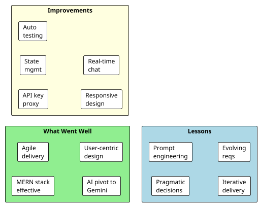

# 9. Project Post-Mortem

## 9.1 Overview

The project post-mortem provides a retrospective evaluation of the SPAREHUBLK project, examining what went well, what could have been improved, and what lessons were learned. This critical appraisal is conducted with the benefit of hindsight now that the project has reached completion.

## 9.2 What Went Well

### 9.2.1 Technology Stack Choices
The decision to use the MERN stack (MongoDB, Express, React, Node.js) proved to be effective. The unified JavaScript ecosystem across frontend and backend reduced context switching and accelerated development. React's component model allowed for rapid UI construction, while Express provided the necessary flexibility for API design without excessive boilerplate. MongoDB's document-oriented nature accommodated the flexible, hierarchical structure of product listings without requiring complex join operations.

### 9.2.2 Agile Incremental Approach
The incremental development methodology allowed the project to deliver a working core marketplace early in the timeline. This provided a stable foundation upon which AI features could be added without destabilising existing functionality. The ability to demonstrate working software at each stage helped maintain momentum and allowed for course correction when necessary.

### 9.2.3 AI Technology Pivot
The decision to pivot from custom TensorFlow models to the Google Gemini API was a turning point that improved both the quality of AI features and the development timeline. The custom model approach, while academically interesting, would likely have resulted in lower accuracy due to limited training data. The Gemini integration delivered functional, accurate AI capabilities that genuinely assist users, demonstrating pragmatic engineering decision-making.

### 9.2.4 User-Centric Design
The dark-themed, modern interface received positive feedback during informal usability checks. The structured listing creation wizard with live preview helps sellers create better-quality listings. The prominent AI tools on the homepage and dedicated AI Tools page make intelligent assistance easily discoverable.

## 9.3 Areas for Improvement

### 9.3.1 API Key Management
The current implementation stores Google Gemini API keys directly in frontend service files. While this simplified development, it is not a production-ready practice. In a future iteration, AI requests should be proxied through the backend, with keys stored securely in environment variables. This would also enable request logging, rate limiting, and caching.

### 9.3.2 State Management Scaling
The decision to use React Context and local state rather than a dedicated state management library worked well for the project's scale. However, as the platform grows, the proliferation of `useState` and `useEffect` hooks in deeply nested components could become difficult to maintain. Introducing a lightweight solution such as Zustand or Redux Toolkit would improve code organisation in future versions.

### 9.3.3 Testing Coverage
While functional testing was thorough, the project lacks automated unit and integration tests. All testing was performed manually, which is time-consuming and not repeatable. Incorporating a testing framework such as Jest (for backend) and Vitest or React Testing Library (for frontend) would significantly improve code reliability and regression detection in future development.

### 9.3.4 Mobile Responsiveness
The application is currently designed for desktop browsers only. While some Tailwind CSS utility classes provide basic viewport adaptation, the interface is not optimised for mobile devices. The multi-step listing wizard, navigation menus, and filter sidebars were designed with desktop interaction patterns in mind and would require significant redesign to be usable on smaller screens. Making the platform fully responsive is a priority for future development.

### 9.3.5 Real-Time Features
The decision to replace peer-to-peer messaging with an AI chatbot was reasonable for the project scope, but a complete marketplace would ultimately benefit from both. Buyers and sellers still need a way to negotiate details, arrange inspections, and confirm transactions. A future iteration should consider integrating WebSocket-based messaging alongside the AI assistant.

### 9.3.6 Data Seeding and Migration
The project lacks a robust database seeding strategy for development and demo purposes. The existing `seed.js` file provides basic data, but more comprehensive seeding with realistic Sri Lankan vehicle data and part listings would improve development testing and demonstration quality.

## 9.4 Technical Challenges and Solutions

### 9.4.1 AI Response Parsing
One unexpected challenge was the variability in Gemini API response formats. While structured prompts requested JSON output, the model occasionally returned free-text responses or malformed JSON. This was addressed by implementing parsing fallbacks in the VIN decoder service that could extract key information from unstructured text when strict JSON parsing failed.

### 9.4.2 Image Upload Handling
Coordinating frontend image previews, multi-file uploads, backend Multer configuration, and database URL storage required careful attention to file handling across the stack. The decision to use disk storage for product images and base64 for profile media simplified some aspects but introduced inconsistency in the storage architecture.

### 9.4.3 Premium User Data Synchronisation
The dual storage of premium application data in both the `User` model (for quick access) and the `PremiumUser` model (for admin workflow) created a synchronisation requirement. Approval and rejection routes must update both documents atomically. While functional, this design could be simplified by using a single source of truth with virtual population.

## 9.5 Process Reflections

### 9.5.1 Time Management
The project phases were generally adhered to, but the AI feature integration took slightly longer than anticipated due to the technology pivot. The time originally allocated to model training and dataset collection was reallocated to API integration and prompt engineering, which ultimately proved more efficient but required schedule flexibility.

### 9.5.2 Requirements Evolution
Requirements evolved naturally during development. The addition of the VIN decoder and the expansion of map functionality were not in the original plan but emerged as high-value features during implementation. An Agile approach accommodated these changes effectively.

### 9.5.3 Documentation
Documentation was maintained alongside development, including the PID, interim report, and this final report. Keeping design documents updated as the architecture evolved (particularly the AI pivot) ensured that the reports accurately reflected the final system.

## 9.6 Personal Development

This project provided significant learning opportunities across multiple domains:
- **Full-Stack Development:** Deepened experience with React, Node.js, Express, and MongoDB in a production-like context.
- **AI Integration:** Gained practical knowledge of prompt engineering, multimodal API usage, and error handling for LLM-based services.
- **UI/UX Design:** Improved skills in creating cohesive, accessible interfaces using Tailwind CSS and animation libraries.
- **Project Management:** Practised Agile planning, task prioritisation, and iterative delivery under time constraints.
- **Problem Solving:** Developed the ability to evaluate technical trade-offs and make pragmatic decisions that balance idealism with deliverability.

## 9.7 Recommendations for Future Work

Based on the post-mortem analysis, the following recommendations are made for continued development of SPAREHUBLK:

1. **Backend-Proxy AI Layer:** Move AI API calls to the backend to secure API keys and enable caching of common queries.
2. **Automated Testing Suite:** Implement unit, integration, and end-to-end tests using Jest, Vitest, and Cypress.
3. **Real-Time Messaging:** Add WebSocket-based peer-to-peer messaging between buyers and sellers.
4. **Mobile Responsiveness:** Redesign the frontend layout and components to be fully responsive across mobile, tablet, and desktop viewports. This includes adapting the navigation, filters, listing wizard, and product grids for smaller screens before considering a native mobile application.
5. **Payment Integration:** Integrate Sri Lankan payment gateways to enable in-platform transactions.
6. **Notification System:** Add email and push notifications for messages, application status updates, and listing alerts.
7. **Analytics Dashboard:** Provide sellers with detailed analytics on listing views, enquiries, and conversion rates.
8. **Enhanced AI Training:** Fine-tune AI responses with a curated dataset of Sri Lankan automotive terminology and pricing benchmarks.

---

**Figure 9.1: Post-Mortem Evaluation Summary**

